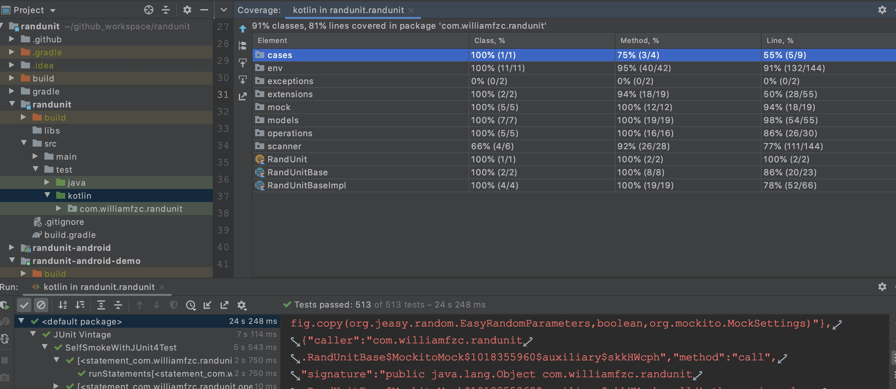

# randunit

[](https://github.com/williamfzc/randunit)
[](https://codecov.io/gh/williamfzc/randunit)
[](https://jitpack.io/#williamfzc/randunit)

> Build Android/JVM applications with confidence and less effort.

[中文文档](./README.zh_CN.md)

## what's it?

RandUnit means `Random UnitTest`, which will:

- scan all the classes in your project by package name or class name
- pick, generate serious of statements
- run them with junit 

All you need is a simple copy-paste:

```kotlin
@RunWith(Parameterized::class)
class SelfSmokeWithJUnit4Test(private val statementModel: StatementModel) {
    companion object {
        private val testEnv = NormalTestEnv()
        private const val packageName = "com.your.package"

        @JvmStatic
        @Parameterized.Parameters(name = "{0}")
        fun data(): Collection<StatementModel> {
            val scannerConfig = ScannerConfig()
            scannerConfig.includeFilter.add(packageName)

            return RandUnit.collectStatementsWithPackage(packageName, scannerConfig)
        }
    }

    @Test
    fun runStatements() {
        testEnv.runWithSandbox(statementModel)
    }
}
```

And you get a ready-to-use smoke test suite. Running it as a normal junit case in IDE:



randunit has generated 500+ cases for your package!

## installation

randunit released on [jitpack.io/#williamfzc/randunit](https://jitpack.io/#williamfzc/randunit).

normal java:

```
dependencies {
    testImplementation "com.github.williamfzc.randunit:randunit-android:0.1.1"
}
```

android:

```
dependencies {
    testImplementation "com.github.williamfzc.randunit:randunit-android:0.1.1"
}
```

## why randunit?

### running on JVM, Android, and more

randunit supports JDK version >= 8. And thanks to [robolectric](https://github.com/robolectric/robolectric), randunit works fine on Android.

See:

- [normal java demo](./randunit-demo)
- [android demo](./randunit-android-demo)
- [google android sample](https://github.com/williamfzc/uamp/commit/af36299bd4f2ce10eba39ec44914d56776a378f9)

### based on junit4/5

Easily reuse all their extensions. Use it as a normal test case, both IDE and CI.

### extendable

Currently randunit is still using a very simple strategy when invoking statements: `invoke with some mocked/random arguments once`. Of course it can not reach every branches of methods.

At the beginning, randunit has been designed as a framework so maybe we can migrate more advance strategies here in some days. see the part `prototype and its future` or [AbstractTestEnv.kt](./randunit/src/main/kotlin/com/williamfzc/randunit/env/AbstractTestEnv.kt) for details.

## effect?

randunit has been used for testing itself. See the screenshot above :)

Also you can see [android sample](https://github.com/williamfzc/uamp).

## prototype and its future

In this area (unittest generator), [randoop](https://github.com/randoop/randoop) and [evosuite](https://github.com/EvoSuite/evosuite) are in the lead. Both of them have provided some great ideas/algorithms for references.

But on the other hand, these two projects focused on algorithm research more (reach higher branch coverage and so on), which cared less on users (no offense, projects are still good).

randunit looks more like a framework. It consists of 3 parts:

- scanner: trying to collect all the data, such as classes, methods.
- generator: using data from scanner, generating series of statements.
- runner(env): actually invoke these statements and show their results.

Based on this structure, 

- algo developers only need to focus on designing `generator`.
- framework developers take the rest.

Current `generator` still has a long way to go.

## should use / should not use

In these days, there are still tons of projects developing without any unittest. `Continuous Test` is nearly the most important part of DevOps workflow. 
At the beginning, this repo was designed for providing smoke tests quickly, without any extra efforts.

### should use

Your project is still running naked yet.

### should not use

You want a strict coverage tool.

## FAQ

### how to suppress some invalid errors?

`random` means some unexpected things may happened. Because of dynamically injections (and reflections, etc.), you will see some cases failed. Unfortunately, randunit can not identify if it is a real bug because it will never know what your real anticipation is.

Users can judge the thrown errors from randunit by themselves easily:

```
// custom rules
class CustomRule : AbstractRule() {
    override fun judge(statement: Statement, e: Throwable): Boolean {

        // return true if you do not think that is a bug
        return when (e) {
            is IllegalStateException -> true
            else -> false
        }
    }
}

// and add it to your env
testEnv.envConfig.sandboxConfig.rules.add(CustomRule())
```

## license

Licensed under the Apache License, Version 2.0 (the "License"). See [LICENSE](LICENSE).

```text
Copyright 2021 williamfzc

Licensed under the Apache License, Version 2.0 (the "License");
you may not use this file except in compliance with the License.
You may obtain a copy of the License at

   http://www.apache.org/licenses/LICENSE-2.0

Unless required by applicable law or agreed to in writing, software
distributed under the License is distributed on an "AS IS" BASIS,
WITHOUT WARRANTIES OR CONDITIONS OF ANY KIND, either express or implied.
See the License for the specific language governing permissions and
limitations under the License.
```
